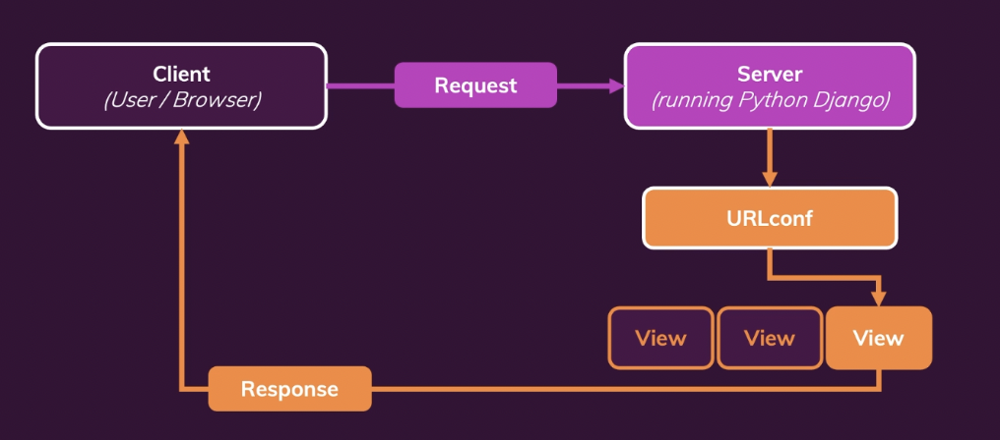

## Install and Setup Django
- https://stackoverflow.com/questions/36446599/zsh-command-not-found-django-admin-when-starting-a-django-project
- Getting started : ```django-admin startproject mysite```
- asgi.py and wsgi.py are related to serving our python django application
- ```python3 manage.py runserver``` built in command for starting the preview environment
- ```python3 manage.py startapp app-name``` creates app in the django project, we refer to the convention of apps instead of module.

## Urls & Views


## Dynamic Path segment & Captured Values
- Dynamic Path segment: So these act as keyword arguments, which Django will use to forward the captured values for these dynamic parameters to the view function that is being executed.
- And in there, we could now check with the IF statement, for example, if month is equal to January.